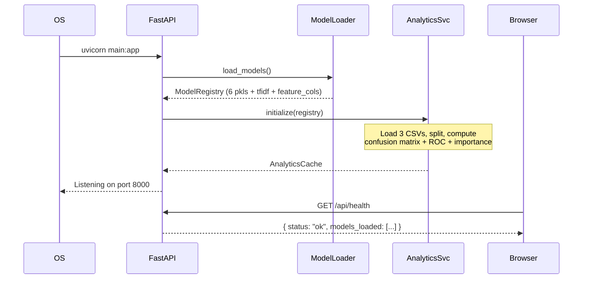

# NTCyber AI Web Platform — Detailed Design

**Project:** COS30049 Computing Technology Innovation Project — Assignment 3
**Team:** Session 01 | Group 1 | Section C1
**Members:** Ng Yong Hin (106214441) · Tee Ren Hang (106214467)
**Source:** Derived from `doc/proposal.md` and `doc/high-level-design.md`

---

## 1. Design Decisions

The following decisions were made to resolve ambiguities in the proposal and HLD.

| # | Decision | Rationale |
|---|---|---|
| D1 | **DBSCAN exposed as `is_anomaly` column in malware results** | DBSCAN has no `predict()` method; it is re-run on each uploaded batch using `pca5` from the saved pkl. Points labeled −1 are flagged as anomalies. Batches < 5 rows skip DBSCAN and set `is_anomaly = false`. |
| D2 | **Analytics computed at server startup** | `AnalyticsService.initialize()` is called once during FastAPI lifespan, after all models are loaded. It reproduces the same train/test splits (random_state=42) from the processed CSVs and caches results in memory. |
| D3 | **Batch spam uses same optional `model` field as single prediction, default `rf_spam`** | Consistent behaviour between single and batch modes. |
| D4 | **Malware CSV must contain pre-scaled feature columns matching `malmem_processed.csv`** | `malmem_scaler.pkl` was fitted after variance filtering; the exact filtered column set is non-trivial to reproduce from raw data. Using the already-scaled format is simpler and allows "Load Sample Data" to directly use `malmem_processed.csv` rows. The backend does **not** re-apply the scaler. |
| D5 | **TF-IDF vectorizer reconstructed at startup from `sms_spam_processed.csv`** | The vectorizer was not saved as a pkl in Assignment 2. A `TfidfVectorizer(max_features=500, stop_words='english', ngram_range=(1,2))` is re-fitted on the `cleaned_message` column to reproduce the same vocabulary and IDF weights. |
| D6 | **RF spam uses engineered features, not TF-IDF** | The `rf_spam.pkl` stores `feature_cols` = `[message_length, word_count, has_*]`. The proposal's description of "TF-IDF → scaler → model" applies only to NB and LR. |
| D7 | **Frontend: React Router v6, CSS Modules for styling** | React Router v6 is the current stable version. CSS Modules are Vite-native and require no extra dependency. |

---

## 2. Actual pkl Structures (from Assignment 2 source)

These differ from the simplified description in the proposal. The detailed design is based on these actual structures.

| File | Pickled value |
|---|---|
| `outputs/models/rf_spam.pkl` | `{'model': RandomForestClassifier, 'feature_cols': list[str]}` |
| `outputs/models/nb_spam.pkl` | `{'model': MultinomialNB, 'scaler': MinMaxScaler}` |
| `outputs/models/logistic_regression_spam.pkl` | `{'model': LogisticRegression, 'scaler': MinMaxScaler, 'feature_names': list[str]}` |
| `outputs/models/svm_malware.pkl` | `SVC` (raw object, no wrapper dict) |
| `outputs/models/kmeans_malware.pkl` | `{'model': KMeans, 'pca': PCA(n_components=10)}` |
| `outputs/models/dbscan_malware.pkl` | `{'model': DBSCAN, 'pca': PCA(n_components=5)}` |
| `data/processed/malmem_scaler.pkl` | `StandardScaler` (not used for inference — see D4) |

---

## 3. Backend Detailed Design

### 3.1 App Entry — `backend/main.py`

**Responsibilities:** Create the FastAPI application, configure CORS, register routers, and orchestrate the startup/shutdown sequence via a lifespan handler.

**Startup sequence (lifespan):**
1. Call `ModelLoader.load_models()` → populate `app.state.registry`
2. Call `AnalyticsService.initialize(app.state.registry)` → populate `app.state.analytics`
3. Log "All models loaded and analytics ready."

**Shutdown sequence:**
- No cleanup required (all state is in-memory).

**CORS configuration:**
```
allow_origins=["http://localhost:5173"]
allow_methods=["GET", "POST", "DELETE"]
allow_headers=["*"]
```

**Router registration:**
```
app.include_router(spam_router,      prefix="/api/spam",        tags=["spam"])
app.include_router(malware_router,   prefix="/api/malware",     tags=["malware"])
app.include_router(analytics_router, prefix="/api/analytics",   tags=["analytics"])
app.include_router(system_router,    prefix="/api",             tags=["system"])
```

---

### 3.2 Model Loader — `backend/services/model_loader.py`

**Responsibilities:** Load all pkl files, reconstruct the TF-IDF vectorizer, and determine the malware feature column list. Returns a `ModelRegistry` dict shared across all services.

**`ModelRegistry` type (TypedDict):**

```python
class ModelRegistry(TypedDict):
    rf_spam:        dict          # {'model': RF, 'feature_cols': list[str]}
    nb_spam:        dict          # {'model': NB, 'scaler': MinMaxScaler}
    lr_spam:        dict          # {'model': LR, 'scaler': MinMaxScaler, 'feature_names': list[str]}
    svm_malware:    SVC           # raw SVC object
    kmeans_malware: dict          # {'model': KMeans, 'pca': PCA(10)}
    dbscan_malware: dict          # {'model': DBSCAN, 'pca': PCA(5)}
    spam_tfidf:     TfidfVectorizer   # reconstructed at startup
    malmem_feature_cols: list[str]    # feature columns in malmem_processed.csv (excluding labels)
```

**Public interface:**

```python
def load_models(
    models_dir: str = "outputs/models",
    processed_dir: str = "data/processed",
    spam_corpus_path: str = "data/processed/sms_spam_processed.csv",
    malmem_path: str = "data/processed/malmem_processed.csv",
) -> ModelRegistry:
    ...
```

**Internal steps:**

1. Load each pkl file with `pickle.load()`.
2. Reconstruct TF-IDF:
   - Load `spam_corpus_path`, extract `cleaned_message` column.
   - Fit `TfidfVectorizer(max_features=500, stop_words='english', ngram_range=(1, 2))` on the column.
   - Store as `registry['spam_tfidf']`.
3. Determine malware feature columns:
   - Load `malmem_path`, drop `['binary_label', 'category_encoded', 'category_name']` (ignoring missing ones).
   - Store remaining column names as `registry['malmem_feature_cols']`.
4. Return registry.

**Error behaviour:**
- If any pkl file is missing, raise `RuntimeError` with the missing path. The server will not start.
- If the spam corpus CSV is missing, raise `RuntimeError`.

---

### 3.3 Spam Service — `backend/services/spam_service.py`

**Responsibilities:** Text cleaning, feature extraction, and inference for all three spam models.

**Public interface:**

```python
def predict_single(
    text: str,
    model_name: str,
    registry: ModelRegistry,
) -> SpamPredictionResult:
    ...

def predict_batch(
    messages: list[str],
    model_name: str,
    registry: ModelRegistry,
) -> list[SpamPredictionResult]:
    ...
```

**`SpamPredictionResult` (dataclass):**

```python
@dataclass
class SpamPredictionResult:
    label: str          # "SPAM" or "HAM"
    spam_prob: float
    ham_prob: float
    confidence: float   # max(spam_prob, ham_prob)
    model_used: str
    timestamp: str      # ISO-8601 UTC
```

**Three model pipelines:**

#### Pipeline A — Random Forest (`rf_spam`)

```
Input: raw text string
1. clean_text(text)                          → cleaned: str
2. Build feature vector using feature_cols from rf_spam pkl:
   - message_length  = len(text)
   - word_count      = len(text.split())
   - has_<kw>        = 1 if kw in cleaned.split() else 0
                        for each has_* in feature_cols
3. np.array(feature_values).reshape(1, -1)   → X: shape (1, n_features)
4. rf.predict_proba(X)                        → [[ham_p, spam_p]]
5. label = "SPAM" if spam_p >= 0.5 else "HAM"
```

#### Pipeline B — Naive Bayes (`nb_spam`)

```
Input: raw text string
1. clean_text(text)                           → cleaned: str
2. spam_tfidf.transform([cleaned])            → X_tfidf: sparse (1, 500)
3. X_tfidf_arr = X_tfidf.toarray()
4. nb_scaler.transform(X_tfidf_arr)           → X_scaled: (1, 500)
5. nb.predict_proba(X_scaled)                 → [[ham_p, spam_p]]
6. label = "SPAM" if spam_p >= 0.5 else "HAM"
```

#### Pipeline C — Logistic Regression (`logistic_regression_spam`)

```
Input: raw text string
1. clean_text(text)                           → cleaned: str
2. spam_tfidf.transform([cleaned])            → X_tfidf: sparse (1, 500)
3. X_tfidf_arr = X_tfidf.toarray()
4. lr_scaler.transform(X_tfidf_arr)           → X_scaled: (1, 500)
5. lr.predict_proba(X_scaled)                 → [[ham_p, spam_p]]
6. label = "SPAM" if spam_p >= 0.5 else "HAM"
```

**`clean_text(text: str) -> str`** (private helper):

```
1. text.lower()
2. re.sub(r'http\S+|www\S+', '', text)    # remove URLs
3. re.sub(r'\S+@\S+', '', text)           # remove emails
4. re.sub(r'\d+', '', text)               # remove numbers
5. re.sub(r'[^a-zA-Z\s]', '', text)       # keep letters and spaces
6. re.sub(r'\s+', ' ', text).strip()
```

**Error behaviour:**
- `predict_single` raises `ValueError("Unknown model: ...")` for unrecognised model names.
- `predict_batch` with an empty list returns an empty list immediately.

---

### 3.4 Malware Service — `backend/services/malware_service.py`

**Responsibilities:** Validate uploaded DataFrame, run SVM + KMeans + DBSCAN + PCA-2D, and return structured results.

**Public interface:**

```python
def predict(
    df: pd.DataFrame,
    registry: ModelRegistry,
) -> MalwarePredictionResult:
    ...

def load_sample_data(
    malmem_path: str = "data/processed/malmem_processed.csv",
    n_rows: int = 10,
) -> pd.DataFrame:
    ...
```

**`MalwarePredictionResult` (dataclass):**

```python
@dataclass
class MalwarePredictionResult:
    total: int
    malware_count: int
    benign_count: int
    pca_data: list[list[float]]    # shape (n_rows, 2)
    results: list[MalwareRowResult]

@dataclass
class MalwareRowResult:
    row: int
    label: str            # "MALWARE" or "BENIGN"
    malware_prob: float
    benign_prob: float
    cluster_id: int
    is_anomaly: bool
```

**Prediction pipeline:**

```
Input: pd.DataFrame with feature columns (pre-scaled)

1. validate_columns(df, registry['malmem_feature_cols'])
   → raises ValueError if any required column is missing

2. X = df[registry['malmem_feature_cols']].fillna(0).values   # shape (n, F)

3. SVM prediction:
   probs  = svm.predict_proba(X)          # shape (n, 2): [[benign_p, malware_p], ...]
   labels = ["MALWARE" if p[1] >= 0.5 else "BENIGN" for p in probs]

4. KMeans cluster assignment:
   pca10  = registry['kmeans_malware']['pca']
   kmeans = registry['kmeans_malware']['model']
   X_10d  = pca10.transform(X)
   cluster_ids = kmeans.predict(X_10d)

5. DBSCAN anomaly detection:
   pca5   = registry['dbscan_malware']['pca']
   X_5d   = pca5.transform(X)
   if n < 5:
       anomaly_flags = [False] * n
   else:
       db = DBSCAN(eps=0.8, min_samples=3)
       db_labels = db.fit_predict(X_5d)
       anomaly_flags = [lbl == -1 for lbl in db_labels]

6. 2D PCA for scatter plot:
   pca2   = PCA(n_components=2)
   X_2d   = pca2.fit_transform(X)         # fresh per-request PCA

7. Assemble MalwarePredictionResult
```

**`validate_columns(df, required_cols)`** (private helper):

```
missing = set(required_cols) - set(df.columns)
if missing:
    raise ValueError(f"Missing columns: {sorted(missing)}")
```

**`load_sample_data`:**

```
1. Load malmem_processed.csv, take first n_rows rows
2. Drop label columns: binary_label, category_encoded, category_name (if present)
3. Return resulting DataFrame
```

---

### 3.5 Analytics Service — `backend/services/analytics_service.py`

**Responsibilities:** Compute and cache performance metrics for RF, NB, LR, and SVM at server startup.

**`AnalyticsCache` (TypedDict):**

```python
class AnalyticsCache(TypedDict):
    rf_spam:                    ModelAnalytics
    nb_spam:                    ModelAnalytics
    logistic_regression_spam:   ModelAnalytics
    svm_malware:                ModelAnalytics

class ModelAnalytics(TypedDict):
    model:            str
    confusion_matrix: list[list[int]]    # [[TN, FP], [FN, TP]]
    roc:              RocData
    feature_importance: list[FeatureImportance] | None   # None for NB and SVM

class RocData(TypedDict):
    fpr: list[float]
    tpr: list[float]
    auc: float

class FeatureImportance(TypedDict):
    feature:    str
    importance: float
```

**Public interface:**

```python
def initialize(registry: ModelRegistry) -> AnalyticsCache:
    ...
```

**Per-model computation:**

#### RF Spam

```
1. Load data/processed/combined_spam_processed.csv
2. feature_cols = registry['rf_spam']['feature_cols']
3. X = df[feature_cols].fillna(0).values
4. y = df['label'].values
5. _, X_test, _, y_test = train_test_split(
       X, y, test_size=0.2, random_state=42, stratify=y)
6. y_pred  = rf.predict(X_test)
7. y_prob  = rf.predict_proba(X_test)[:, 1]
8. Build confusion_matrix(y_test, y_pred)
9. fpr, tpr, _ = roc_curve(y_test, y_prob); auc = roc_auc_score(y_test, y_prob)
10. importances = sorted zip(feature_cols, rf.feature_importances_) by importance desc
```

#### NB Spam

```
1. Load data/processed/sms_spam_tfidf.csv
2. y = df['label_encoded'].values
3. X = df.drop('label_encoded', axis=1).values
4. X = registry['nb_spam']['scaler'].transform(X)
5. _, X_test, _, y_test = train_test_split(
       X, y, test_size=0.2, random_state=42, stratify=y)
6. y_pred = nb.predict(X_test)
7. y_prob = nb.predict_proba(X_test)[:, 1]
8. Build confusion_matrix, ROC, AUC
9. feature_importance = None
```

#### LR Spam

```
Same as NB except use lr_scaler and lr model.
feature_importance = top 20 |coef| values from lr.coef_[0],
  paired with registry['lr_spam']['feature_names'],
  sorted by absolute value descending.
```

#### SVM Malware

```
1. Load data/processed/malmem_processed.csv
2. drop_cols = [c for c in ['binary_label','category_encoded','category_name'] if c in df]
3. X = df.drop(columns=drop_cols).values
4. y = df['binary_label'].values
5. If len(X) > 20000: subsample with RandomState(42).choice(len(X), 20000, replace=False)
6. _, X_test, _, y_test = train_test_split(
       X, y, test_size=0.2, random_state=42, stratify=y)
7. y_pred = svm.predict(X_test)
8. y_prob = svm.predict_proba(X_test)[:, 1]
9. Build confusion_matrix, ROC, AUC
10. feature_importance = None
```

**Error behaviour:** If any dataset CSV is missing, log a warning and set that model's analytics to `None`. The `/api/analytics/model/{name}` endpoint returns 503 for a model with `None` analytics.

---

### 3.6 History Store — `backend/history_store.py`

**Responsibilities:** Thread-safe in-memory log of all predictions across all models.

**`PredictionEntry` (dataclass):**

```python
@dataclass
class PredictionEntry:
    timestamp: datetime   # UTC
    model:     str        # e.g. "rf_spam", "svm_malware"
    task:      str        # "spam" or "malware"
    label:     str        # "SPAM", "HAM", "MALWARE", "BENIGN"
    confidence: float
```

**`HistoryStore` class:**

```python
class HistoryStore:
    def __init__(self) -> None:
        self._entries: list[PredictionEntry] = []
        self._lock: threading.Lock = threading.Lock()

    def append(self, entry: PredictionEntry) -> None:
        with self._lock:
            self._entries.append(entry)

    def query_since(self, since: datetime) -> list[PredictionEntry]:
        with self._lock:
            return [e for e in self._entries if e.timestamp >= since]

    def get_recent(self, n: int = 10) -> list[PredictionEntry]:
        with self._lock:
            return list(self._entries[-n:])

    def to_time_series(
        self, since: datetime
    ) -> tuple[list[dict], list[dict]]:
        """Return (spam_series, malware_series) bucketed by minute."""
        ...

    def clear(self) -> None:
        with self._lock:
            self._entries.clear()

    def __len__(self) -> int:
        with self._lock:
            return len(self._entries)
```

**`to_time_series` logic:**

```
1. Filter entries with timestamp >= since
2. Group by (task, minute-truncated timestamp)
3. Return:
   spam_series    = [{'timestamp': ..., 'count': n}, ...]
   malware_series = [{'timestamp': ..., 'count': n}, ...]
   Both sorted ascending by timestamp.
```

**Module-level singleton:** `history_store = HistoryStore()` (imported by routers).

---

### 3.7 Spam Router — `backend/routers/spam.py`

**Pydantic models:**

```python
class SpamPredictRequest(BaseModel):
    text:  str   = Field(..., min_length=3)
    model: str   = Field(default="rf_spam")

    @validator('model')
    def model_must_be_valid(cls, v):
        allowed = {'rf_spam', 'nb_spam', 'logistic_regression_spam'}
        if v not in allowed:
            raise ValueError(f"model must be one of {allowed}")
        return v

class SpamBatchRequest(BaseModel):
    model: str = Field(default="rf_spam")

class SpamPredictResponse(BaseModel):
    label:      str
    spam_prob:  float
    ham_prob:   float
    confidence: float
    model_used: str
    timestamp:  str

class SpamBatchResponse(BaseModel):
    total:      int
    spam_count: int
    ham_count:  int
    model_used: str
    results:    list[SpamRowResult]

class SpamRowResult(BaseModel):
    row:       int
    text:      str
    label:     str
    spam_prob: float
```

**Endpoint: `POST /api/spam/predict`**

```
1. Validate request (Pydantic raises 422 automatically)
2. Call SpamService.predict_single(text, model, registry)
3. history_store.append(PredictionEntry(...))
4. Return SpamPredictResponse
```

**Endpoint: `POST /api/spam/predict/batch`**

```
Request: multipart/form-data
  - file:  UploadFile  (.txt or .csv)
  - model: str = "rf_spam"  (Form field)

1. Validate model name (same validator)
2. Read file contents:
   If .txt:  lines = content.splitlines(); messages = [l for l in lines if l.strip()]
   If .csv:  df = pd.read_csv(io.BytesIO(content))
             if 'message' not in df.columns: raise HTTPException(422, "CSV must have 'message' column")
             messages = df['message'].tolist()
   Else: raise HTTPException(422, "File must be .txt or .csv")
3. if len(messages) == 0: raise HTTPException(422, "File contains no messages")
4. results = SpamService.predict_batch(messages, model, registry)
5. For each result: history_store.append(...)
6. Return SpamBatchResponse
```

---

### 3.8 Malware Router — `backend/routers/malware.py`

**Pydantic models:**

```python
class MalwareRowResponse(BaseModel):
    row:          int
    label:        str
    malware_prob: float
    benign_prob:  float
    cluster_id:   int
    is_anomaly:   bool

class MalwarePredictResponse(BaseModel):
    total:         int
    malware_count: int
    benign_count:  int
    pca_data:      list[list[float]]
    results:       list[MalwareRowResponse]
```

**Endpoint: `POST /api/malware/predict`**

```
Request: multipart/form-data, field 'file' (.csv)

1. if file.content_type not in ('text/csv', 'application/csv', 'application/octet-stream'):
       raise HTTPException(422, "File must be a CSV")
2. df = pd.read_csv(io.BytesIO(await file.read()))
3. try:
       result = MalwareService.predict(df, registry)
   except ValueError as e:
       raise HTTPException(422, str(e))
4. For each row result: history_store.append(PredictionEntry(task='malware', ...))
5. Return MalwarePredictResponse
```

**Endpoint: `GET /api/malware/sample`**

```
1. df = MalwareService.load_sample_data()
2. Return the DataFrame as JSON records:
   { "columns": [...], "rows": [[...], ...] }
```

This endpoint lets the frontend pre-populate the file upload widget with a sample.

---

### 3.9 Analytics Router — `backend/routers/analytics.py`

**Pydantic models:**

```python
class FeatureImportanceItem(BaseModel):
    feature:    str
    importance: float

class RocData(BaseModel):
    fpr: list[float]
    tpr: list[float]
    auc: float

class ModelAnalyticsResponse(BaseModel):
    model:              str
    confusion_matrix:   list[list[int]]
    roc:                RocData
    feature_importance: list[FeatureImportanceItem] | None
```

**Endpoint: `GET /api/analytics/model/{model_name}`**

```
Allowed model_name values: rf_spam | nb_spam | logistic_regression_spam | svm_malware

1. if model_name not in ALLOWED_MODELS:
       raise HTTPException(404, f"Unknown model: {model_name}")
2. data = app.state.analytics.get(model_name)
3. if data is None:
       raise HTTPException(503, "Analytics not available for this model")
4. Return ModelAnalyticsResponse(**data)
```

---

### 3.10 System Router — `backend/routers/system.py`

**Endpoint: `GET /api/health`**

```
Return:
{
  "status": "ok",
  "models_loaded": ["rf_spam", "nb_spam", "logistic_regression_spam",
                    "svm_malware", "kmeans_malware", "dbscan_malware"]
}
Status 200 always (if server is running, models are loaded — lifespan ensures this).
```

**Endpoint: `GET /api/models`**

```
Return pre-defined metrics dict (hardcoded from Assignment 2 results):
{
  "models": [
    {"name": "rf_spam",   "task": "Spam Detection",    "accuracy": ..., "f1": ..., "auc": ...},
    {"name": "nb_spam",   "task": "Spam Detection",    "accuracy": ..., "f1": ..., "auc": ...},
    {"name": "lr_spam",   "task": "Spam Detection",    "accuracy": ..., "f1": ..., "auc": ...},
    {"name": "svm_malware","task":"Malware Detection", "accuracy": ..., "f1": ..., "auc": ...}
  ]
}
Values are filled in from outputs/classification_results.csv and outputs/regression_results.csv
during implementation.
```

**Endpoint: `GET /api/predictions/history`**

```
Query params: since (optional ISO-8601 string, default = now − 60 minutes)

1. Parse since; if invalid format: raise HTTPException(400, "Invalid since timestamp")
2. spam_series, malware_series = history_store.to_time_series(since)
3. Return { "spam_series": [...], "malware_series": [...] }
```

**Endpoint: `DELETE /api/predictions/history`**

```
1. history_store.clear()
2. Return { "message": "Prediction history cleared." }
```

---

## 4. Backend Error Handling Matrix

| Scenario | HTTP Status | Response body |
|---|---|---|
| Pydantic validation failure | 422 | `{"detail": [{"loc": ..., "msg": ...}]}` (FastAPI default) |
| Invalid spam model name | 400 | `{"detail": "model must be one of {...}"}` |
| Spam text too short (< 3 chars) | 422 | Pydantic default |
| Batch file wrong format | 422 | `{"detail": "File must be .txt or .csv"}` |
| Batch CSV missing 'message' column | 422 | `{"detail": "CSV must have 'message' column"}` |
| Malware CSV missing required columns | 422 | `{"detail": "Missing columns: [...]"}` |
| Analytics model name not found | 404 | `{"detail": "Unknown model: ..."}` |
| Analytics data not computed | 503 | `{"detail": "Analytics not available for this model"}` |
| Unhandled server exception | 500 | `{"detail": "Internal server error"}` |

A global exception handler in `main.py` catches all unhandled `Exception` and returns 500.

---

## 5. Frontend Detailed Design

### 5.1 API Client — `src/api/client.js`

**Responsibilities:** Create an Axios instance with base URL and a global error response interceptor.

```javascript
import axios from 'axios';

const client = axios.create({
    baseURL: 'http://localhost:8000',
    timeout: 30000,       // 30 s — generous for batch uploads
});

// Response interceptor: extract error message from FastAPI detail field
client.interceptors.response.use(
    (response) => response,
    (error) => {
        const message =
            error.response?.data?.detail ??
            error.message ??
            'An unexpected error occurred.';
        return Promise.reject(new Error(message));
    }
);

export default client;
```

Pages catch the rejected promise and pass the `error.message` string to `<ErrorBanner>`.

---

### 5.2 API Modules — `src/api/`

Each module exports plain async functions. They hold no state.

#### `src/api/spamApi.js`

```javascript
export async function predictSingle(text, model = 'rf_spam') {
    const { data } = await client.post('/api/spam/predict', { text, model });
    return data;   // SpamPredictResponse
}

export async function predictBatch(file, model = 'rf_spam') {
    const form = new FormData();
    form.append('file', file);
    form.append('model', model);
    const { data } = await client.post('/api/spam/predict/batch', form);
    return data;   // SpamBatchResponse
}
```

#### `src/api/malwareApi.js`

```javascript
export async function predictMalware(file) {
    const form = new FormData();
    form.append('file', file);
    const { data } = await client.post('/api/malware/predict', form);
    return data;   // MalwarePredictResponse
}

export async function getSampleData() {
    const { data } = await client.get('/api/malware/sample');
    return data;   // { columns: [...], rows: [[...], ...] }
}
```

#### `src/api/analyticsApi.js`

```javascript
export async function getModelAnalytics(modelName) {
    const { data } = await client.get(`/api/analytics/model/${modelName}`);
    return data;   // ModelAnalyticsResponse
}
```

#### `src/api/historyApi.js`

```javascript
export async function getHistory(since = null) {
    const params = since ? { since } : {};
    const { data } = await client.get('/api/predictions/history', { params });
    return data;   // { spam_series, malware_series }
}

export async function clearHistory() {
    const { data } = await client.delete('/api/predictions/history');
    return data;
}

export async function getModels() {
    const { data } = await client.get('/api/models');
    return data;   // { models: [...] }
}
```

---

### 5.3 Shared UI Components — `src/components/`

#### `NavBar.jsx`

Props: none (reads `useLocation` from React Router for active highlighting)

```
Renders: app title + links to Dashboard | Spam Detector | Malware Detector | Model Analytics
Active link is highlighted via CSS Module class.
```

#### `ErrorBanner.jsx`

Props:
```typescript
interface ErrorBannerProps {
    message: string | null;   // null = hidden
    onDismiss: () => void;
}
```

Renders a red dismissible banner. Renders `null` when `message` is `null`.

#### `FileUploadWidget.jsx`

Props:
```typescript
interface FileUploadWidgetProps {
    accept: string;          // e.g. ".csv", ".txt,.csv"
    label: string;
    onFileSelected: (file: File) => void;
    disabled?: boolean;
}
```

Renders a styled file input. Validates `file.name` extension against `accept` and calls `onFileSelected` only if valid; otherwise sets an inline error string.

#### `ExportButton.jsx`

Props:
```typescript
interface ExportButtonProps {
    data: object[] | string;   // array of objects (converted to CSV) or raw string
    filename: string;
    label?: string;            // button text, default "Download CSV"
    disabled?: boolean;
}
```

On click: creates a `Blob` from `data` (converts object array to CSV via a helper), creates a temporary `<a>` with `URL.createObjectURL`, clicks it, then revokes the URL.

```javascript
function objectsToCsv(rows) {
    if (!rows.length) return '';
    const headers = Object.keys(rows[0]).join(',');
    const body = rows.map(r => Object.values(r).join(',')).join('\n');
    return `${headers}\n${body}`;
}
```

#### `ProgressIndicator.jsx`

Props:
```typescript
interface ProgressIndicatorProps {
    visible: boolean;
    label?: string;   // default "Processing..."
}
```

Renders a spinner div when `visible` is `true`.

#### `ResultsTable.jsx`

Props:
```typescript
interface ResultsTableProps {
    columns: string[];
    rows: (string | number | boolean)[][];
    maxHeight?: string;   // CSS value, default "400px"
}
```

Renders an overflow-scrollable table. Boolean cells render as ✓ or ✗.

---

### 5.4 Chart Components — `src/components/charts/`

All chart components are **stateless** — they receive data via props and redraw an SVG via D3 in a `useEffect` when data or theme changes.

**Shared pattern:**

```jsx
function SomeChart({ data, title }) {
    const containerRef = useRef(null)
    const { theme } = useTheme()
    useEffect(() => {
        const container = containerRef.current
        if (!container) return
        const draw = () => {
            d3.select(container).selectAll('*').remove()
            const { bg, text, muted, border } = getThemeColors()
            const W = container.clientWidth || 600
            // ... build SVG with d3.select(container).append('svg') ...
        }
        draw()
        window.addEventListener('resize', draw)
        return () => window.removeEventListener('resize', draw)
    }, [data, title, theme])
    return <div ref={containerRef} style={{ width: '100%', position: 'relative' }} />
}
```

All charts support hover tooltips, responsive resize, and light/dark theme switching via CSS variables.

#### `BarChart.jsx`

Props:
```typescript
interface BarChartProps {
    models:   string[];    // x-axis labels
    accuracy: number[];
    f1:       number[];
    auc:      number[];
    title?:   string;
}
```

Renders three grouped bar traces (accuracy, F1, AUC).

#### `LineChart.jsx`

Props:
```typescript
interface LineChartProps {
    spamSeries:    { timestamp: string; count: number }[];
    malwareSeries: { timestamp: string; count: number }[];
    title?:        string;
}
```

Two line traces on a shared time-axis. Used by Dashboard for live refresh.

#### `GaugeChart.jsx`

Props:
```typescript
interface GaugeChartProps {
    spamProb: number | null;   // null = empty state
    label?:   string;          // "SPAM" or "HAM"
}
```

Renders a D3 semicircle gauge using `d3.arc`. Color transitions red ≥ 0.5 else green.

#### `ScatterPlot.jsx`

Props:
```typescript
interface ScatterPlotProps {
    pcaData:  number[][];    // [[x, y], ...]
    labels:   string[];      // "MALWARE" or "BENIGN" per point
    clusters: number[];      // cluster_id per point
    anomalies: boolean[];    // is_anomaly per point
    rowIds:   number[];
    title?:   string;
}
```

Renders four traces: BENIGN (green circle), MALWARE (red circle), anomaly markers (black X), and cluster centre annotations.

#### `Heatmap.jsx`

Props:
```typescript
interface HeatmapProps {
    matrix: number[][];           // [[TN, FP], [FN, TP]]
    labels: string[];             // axis labels, e.g. ["Ham", "Spam"]
    title?:  string;
}
```

Renders a D3 `scaleBand` heatmap with multi-stop colour scale and annotated cell values.

---

### 5.5 Pages — `src/pages/`

#### `Dashboard.jsx`

**State:**

```typescript
const [models, setModels]           = useState([]);
const [history, setHistory]         = useState({ spam_series: [], malware_series: [] });
const [recentPredictions, setRecent] = useState([]);
const [error, setError]             = useState(null);
```

**Effects:**

```
useEffect (mount):
  getModels()  → setModels
  getHistory() → setHistory; last 10 entries → setRecent

useEffect (auto-refresh):
  interval = setInterval(() => getHistory().then(setHistory), 5000)
  return () => clearInterval(interval)
```

**Layout:**

```
NavBar
ErrorBanner (error)
Row: 4 model performance cards (accuracy, F1 per model)
BarChart (models, accuracy, f1, auc)
LineChart (history.spam_series, history.malware_series)  ← auto-refreshes
ResultsTable (recentPredictions)
ExportButton (recentPredictions, filename="predictions.csv")
```

---

#### `SpamDetector.jsx`

**State:**

```typescript
const [mode, setMode]           = useState('single');   // 'single' | 'batch'
const [text, setText]           = useState('');
const [selectedModel, setModel] = useState('rf_spam');
const [result, setResult]       = useState(null);
const [batchFile, setBatchFile] = useState(null);
const [batchResult, setBatchResult] = useState(null);
const [loading, setLoading]     = useState(false);
const [error, setError]         = useState(null);
const [history, setHistory]     = useState([]);
```

**Single-message validation (client-side, before API call):**

```
if (text.trim().length < 3) → setError("Message must be at least 3 characters")
```

**Single-message submit handler:**

```
1. setLoading(true); setError(null)
2. result = await predictSingle(text, selectedModel)
3. setResult(result)
4. setHistory(prev => [result, ...prev])
5. setLoading(false)
catch: setError(err.message); setLoading(false)
```

**Batch submit handler:**

```
1. if !batchFile → setError("Please upload a file first"); return
2. setLoading(true); setError(null)
3. result = await predictBatch(batchFile, selectedModel)
4. setBatchResult(result)
5. setLoading(false)
catch: setError(err.message); setLoading(false)
```

**Layout:**

```
NavBar
ErrorBanner
Tabs: [Single] [Batch]

Single tab:
  Textarea (text), ModelSelector dropdown, Analyze button
  ProgressIndicator (loading)
  GaugeChart (result?.spam_prob)
  Label: "SPAM" / "HAM" + confidence %
  ResultsTable (history, columns: text | model | label | confidence)
  ExportButton (history)

Batch tab:
  FileUploadWidget (accept=".txt,.csv")
  ModelSelector dropdown
  Upload & Analyze button
  ProgressIndicator (loading)
  if batchResult:
    Summary: {spam_count} SPAM / {ham_count} HAM of {total}
    ResultsTable (batchResult.results)
    ExportButton (batchResult.results)
```

---

#### `MalwareDetector.jsx`

**State:**

```typescript
const [file, setFile]             = useState(null);
const [result, setResult]         = useState(null);
const [loading, setLoading]       = useState(false);
const [error, setError]           = useState(null);
const [columnWarnings, setWarnings] = useState([]);
```

**"Load Sample Data" handler:**

```
1. data = await getSampleData()
2. Convert { columns, rows } to CSV string
3. Create a File object from the CSV string
4. setFile(sampleFile)
```

**Submit handler:**

```
1. if !file → setError("Please upload a CSV file"); return
2. setLoading(true); setError(null); setWarnings([])
3. result = await predictMalware(file)
4. setResult(result)
5. setLoading(false)
catch: setError(err.message); setLoading(false)
```

**Layout:**

```
NavBar
ErrorBanner
FileUploadWidget (accept=".csv")
"Load Sample Data" button
Upload & Analyze button
ProgressIndicator (loading)

if result:
  Summary cards: malware_count | benign_count | total | anomaly_count
  ResultsTable (result.results, columns: row | label | malware_prob | cluster_id | is_anomaly)
  ScatterPlot (pca_data, labels, clusters, anomalies)
  ExportButton (result.results, filename="malware_results.csv")
```

---

#### `ModelAnalytics.jsx`

**State:**

```typescript
const [activeModel, setActiveModel]  = useState('rf_spam');
const [analytics, setAnalytics]      = useState({});    // keyed by model name
const [loading, setLoading]          = useState(false);
const [error, setError]              = useState(null);
```

**Effect (on activeModel change):**

```
if activeModel already in analytics: return   // cache hit, no re-fetch
setLoading(true)
data = await getModelAnalytics(activeModel)
setAnalytics(prev => ({ ...prev, [activeModel]: data }))
setLoading(false)
catch: setError(err.message); setLoading(false)
```

**Layout:**

```
NavBar
ErrorBanner
Tabs: [RF Spam] [Naive Bayes] [Logistic Regression] [SVM Malware]

Active model panel:
  ProgressIndicator (loading)
  if analytics[activeModel]:
    Heatmap (confusion_matrix)
    LineChart-style ROC curve (fpr, tpr, auc)
    if feature_importance not null:
      BarChart (horizontal, feature importance)
```

---

## 6. Frontend Routing — `src/App.jsx`

```jsx
import { BrowserRouter, Routes, Route, Navigate } from 'react-router-dom';

function App() {
    return (
        <BrowserRouter>
            <Routes>
                <Route path="/"           element={<Navigate to="/dashboard" />} />
                <Route path="/dashboard"  element={<Dashboard />} />
                <Route path="/spam"       element={<SpamDetector />} />
                <Route path="/malware"    element={<MalwareDetector />} />
                <Route path="/analytics"  element={<ModelAnalytics />} />
            </Routes>
        </BrowserRouter>
    );
}
```

---

## 7. Application Startup Sequence



Estimated startup time: 5–15 seconds (dominated by TF-IDF re-fit and analytics computation).

---

## 8. Per-Module Test Plan

Each module can be tested independently. Tests are written as unit tests (backend: pytest; frontend: React Testing Library).

### 8.1 Model Loader

| Test | Pass condition |
|---|---|
| All 6 pkl files load without error | No exception raised |
| `registry['spam_tfidf']` has 500 features | `len(vectorizer.vocabulary_) == 500` |
| `registry['malmem_feature_cols']` excludes label columns | None of `binary_label`, `category_encoded`, `category_name` in list |
| Missing pkl file raises RuntimeError | `pytest.raises(RuntimeError)` |

### 8.2 Spam Service

| Test | Pass condition |
|---|---|
| RF predicts "SPAM" for known spam text ("Win a FREE prize!") | `result.label == "SPAM"` |
| RF predicts "HAM" for normal text ("Are you free for lunch?") | `result.label == "HAM"` |
| NB and LR also classify "Win a FREE prize!" as SPAM | Both return `label == "SPAM"` |
| `predict_single` with unknown model raises ValueError | `pytest.raises(ValueError)` |
| `predict_batch` with empty list returns empty list | `result == []` |
| `clean_text` removes URLs | `"http://win.com"` → no URL in output |
| RF feature vector length matches `len(feature_cols)` | Assertion |

### 8.3 Malware Service

| Test | Pass condition |
|---|---|
| `predict` returns correct number of rows | `len(result.results) == len(input_df)` |
| Missing required column raises ValueError with column name in message | `pytest.raises(ValueError, match="Missing columns")` |
| `pca_data` shape is (n_rows, 2) | `len(result.pca_data) == n_rows and len(result.pca_data[0]) == 2` |
| `is_anomaly` set to False for batch < 5 | All `is_anomaly == False` |
| `load_sample_data` returns DataFrame with no label columns | No `binary_label` in columns |

### 8.4 Analytics Service

| Test | Pass condition |
|---|---|
| All 4 model analytics are populated after `initialize()` | No `None` values in cache |
| RF confusion matrix has correct shape (2×2) | Shape assertion |
| RF feature_importance is non-empty | `len > 0` |
| NB feature_importance is None | Assertion |
| AUC values are in [0, 1] | Range assertion |

### 8.5 History Store

| Test | Pass condition |
|---|---|
| `append` then `__len__` returns 1 | Assertion |
| `query_since` returns only entries after threshold | Only entries ≥ since |
| `clear` empties the store | `len(store) == 0` after clear |
| Thread-safety: 50 threads each append 100 entries | `len(store) == 5000` |
| `to_time_series` groups by minute correctly | Counts match expected |

### 8.6 Spam Router

| Test | Pass condition |
|---|---|
| `POST /api/spam/predict` with valid body returns 200 | Status code |
| `text` shorter than 3 chars returns 422 | Status code |
| Invalid `model` returns 400 | Status code and detail message |
| `POST /api/spam/predict/batch` with valid .txt returns 200 | Status code and `total > 0` |
| Batch with .csv missing `message` column returns 422 | Status code |

### 8.7 Malware Router

| Test | Pass condition |
|---|---|
| `POST /api/malware/predict` with valid CSV returns 200 | Status code |
| CSV with missing required columns returns 422 | Status code and column names in detail |
| `GET /api/malware/sample` returns 10 rows | `len(rows) == 10` |

### 8.8 Analytics Router

| Test | Pass condition |
|---|---|
| `GET /api/analytics/model/rf_spam` returns 200 | Status code |
| Unknown model name returns 404 | Status code |

### 8.9 System Router

| Test | Pass condition |
|---|---|
| `GET /api/health` returns `status: "ok"` | Assertion |
| `GET /api/predictions/history` after two predictions returns non-empty series | `spam_series` count > 0 |
| `DELETE /api/predictions/history` then `GET` returns empty series | Empty lists |

### 8.10 Frontend — API Modules

| Test | Pass condition |
|---|---|
| `predictSingle` calls `POST /api/spam/predict` | MSW mock intercept |
| `predictBatch` sends FormData with `file` and `model` fields | Intercepted FormData inspection |
| Error response sets `error.message` from `detail` field | Axios interceptor test |

### 8.11 Frontend — Shared Components

| Test | Pass condition |
|---|---|
| `ErrorBanner` hidden when `message` is `null` | Not in DOM |
| `FileUploadWidget` rejects wrong extension | Inline error text rendered |
| `ExportButton` triggers download on click | `URL.createObjectURL` called |

### 8.12 Frontend — Pages (integration, manual testing)

| Test | Pass condition |
|---|---|
| Dashboard auto-refresh updates LineChart every 5 s | Visually verify |
| Spam single-message flow: enter text → select model → analyze → gauge updates | Gauge value matches API response |
| Spam batch flow: upload .txt → results table rendered | Table row count matches total |
| Malware: "Load Sample Data" → upload → scatter plot rendered | 10 points visible |
| ModelAnalytics tab switch loads different model data | Heatmap labels change |
| ErrorBanner appears on API 422 | Banner text visible |
