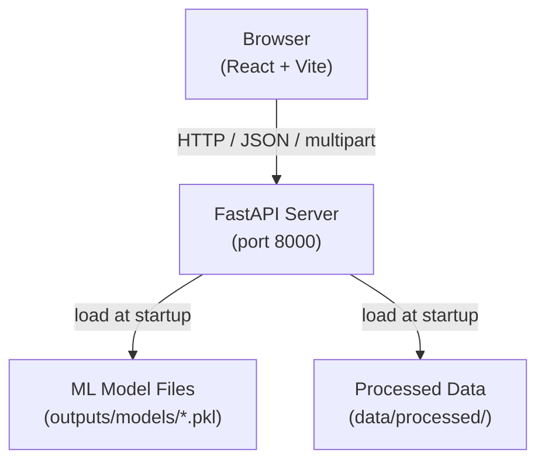
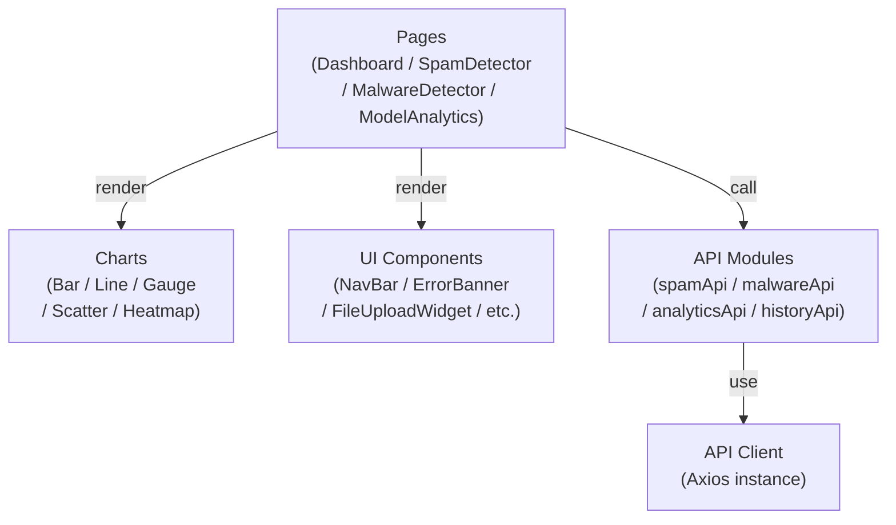
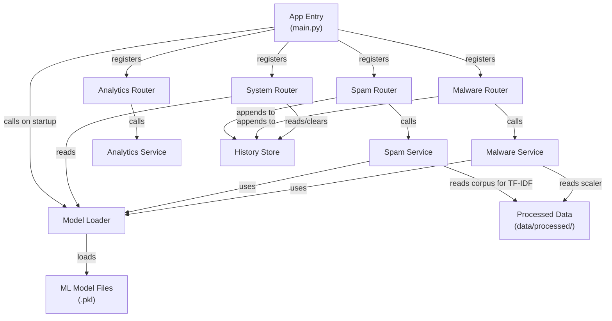

# NTCyber AI Web Platform — High-Level Design

**Project:** COS30049 Computing Technology Innovation Project — Assignment 3
**Team:** Session 01 | Group 1 | Section C1
**Members:** Ng Yong Hin (106214441) · Tee Ren Hang (106214467)
**Source:** Derived from `doc/proposal.md`

---

## 1. System Architecture Overview

The system is a two-tier web application. The browser (React) communicates with a local FastAPI server over HTTP/JSON. The server loads six pre-trained scikit-learn models at startup and serves predictions without retraining.



---

## 2. Module Decomposition

### 2.1 Frontend Modules

| Module | Path | Responsibility |
|---|---|---|
| **Pages** | `src/pages/` | Four top-level route views: Dashboard, SpamDetector, MalwareDetector, ModelAnalytics |
| **Charts** | `src/components/charts/` | Five reusable Plotly.js chart wrappers (one per chart type) |
| **UI Components** | `src/components/` | NavBar, ErrorBanner, ResultsTable, FileUploadWidget, ExportButton, ProgressIndicator |
| **API Client** | `src/api/client.js` | Axios instance with base URL and global error interceptor |
| **API Modules** | `src/api/` | Per-domain function sets: `spamApi`, `malwareApi`, `analyticsApi`, `historyApi` |

### 2.2 Backend Modules

| Module | Path | Responsibility |
|---|---|---|
| **App Entry** | `backend/main.py` | FastAPI app creation, CORS middleware, lifespan handler, router registration |
| **Spam Router** | `backend/routers/spam.py` | `/api/spam/predict` and `/api/spam/predict/batch` |
| **Malware Router** | `backend/routers/malware.py` | `/api/malware/predict` |
| **Analytics Router** | `backend/routers/analytics.py` | `/api/analytics/model/{model_name}` |
| **System Router** | `backend/routers/system.py` | `/api/health`, `/api/models`, `/api/predictions/history` (GET + DELETE) |
| **Model Loader** | `backend/services/model_loader.py` | Loads all six `.pkl` files once at startup; exposes a shared model registry |
| **Spam Service** | `backend/services/spam_service.py` | Text cleaning → TF-IDF vectorisation → MinMaxScaler → model prediction |
| **Malware Service** | `backend/services/malware_service.py` | CSV parsing → column validation → scaling → SVM prediction → PCA projection → K-Means cluster lookup |
| **Analytics Service** | `backend/services/analytics_service.py` | Reads pre-computed metric JSON; returns confusion matrix, ROC, feature importance |
| **History Store** | `backend/history_store.py` | Thread-safe in-memory log of every prediction; supports append, query by time window, clear |

---

## 3. Inter-Module Relationships

### 3.1 Frontend



Pages orchestrate all UI state. Charts and UI Components are stateless — they receive data via props. API Modules hold no state; they issue HTTP calls and return promises.

### 3.2 Backend



Model Loader is the single point of model access; no router or service loads `.pkl` files directly. History Store is the single point of prediction log mutation.

---

## 4. Key Data Flows

### 4.1 Single-Message Spam Prediction

```
SpamDetector page
  → spamApi.predict(text, model)
    → POST /api/spam/predict
      → Spam Router validates request (Pydantic)
        → Spam Service: clean text → TF-IDF → MinMaxScaler → model.predict_proba()
        → History Store: append entry
      ← { label, spam_prob, ham_prob, confidence, model_used, timestamp }
  ← GaugeChart updates; history row appended
```

### 4.2 Malware CSV Upload

```
MalwareDetector page
  → malwareApi.predict(file)
    → POST /api/malware/predict (multipart/form-data)
      → Malware Router validates column headers
        → Malware Service: read CSV → scale → SVM.predict() → PCA.transform() → KMeans.predict()
        → History Store: append entries
      ← { total, malware_count, benign_count, pca_data, results[] }
  ← ResultsTable renders rows; ScatterPlot renders PCA projection
```

### 4.3 Dashboard Live Refresh

```
Dashboard page (mounted)
  → setInterval every 5 s
    → historyApi.getHistory(since)
      → GET /api/predictions/history?since=...
        → System Router: query History Store
      ← { spam_series[], malware_series[] }
  ← LineChart re-renders with new counts
```

---

## 5. Module Responsibilities Summary

| Module | Owns | Does NOT own |
|---|---|---|
| Pages | UI state, user interaction logic | HTTP calls, chart rendering, ML logic |
| Charts | Plotly figure creation and update | Data fetching, business logic |
| API Client | Base URL, auth headers, error interception | Request content, response mapping |
| API Modules | Endpoint paths, request/response shape | HTTP transport, UI state |
| App Entry | App lifecycle, CORS, routing | Business logic |
| Routers | Request validation, response serialisation, HTTP status codes | ML inference, data storage |
| Services | ML pipeline (clean / scale / predict / transform) | Persistence, HTTP concerns |
| Model Loader | Model registry lifecycle (load once, share) | Model training, prediction logic |
| History Store | Prediction log (append, query, clear) | Prediction logic, HTTP concerns |

---

## 6. Key Design Decisions

| Decision | Rationale |
|---|---|
| All six models loaded at startup via `lifespan` | Avoids per-request cold-start; SVM with 20 k training samples uses ~1 GB RAM — single load is essential |
| TF-IDF vectoriser re-fitted from `data/processed/sms_spam_processed.csv` at startup | Vectoriser was not saved as `.pkl` in Assignment 2; training corpus is available and small enough to fit in memory |
| History Store is in-memory (not a database) | Assignment scope does not require persistence across server restarts; simplifies deployment |
| PCA projection computed in Malware Service per request | 2-D PCA coordinates are sent to the frontend with each prediction batch rather than pre-computed, so the scatter plot always reflects the exact uploaded data |
| Analytics data is pre-computed JSON | Confusion matrices, ROC curves, and feature importances do not change at runtime — serving static JSON is faster and avoids re-computing metrics on every request |
| Frontend error handling via Axios interceptor | Centralises 4xx/5xx handling in one place; individual API modules do not need try/catch boilerplate |
